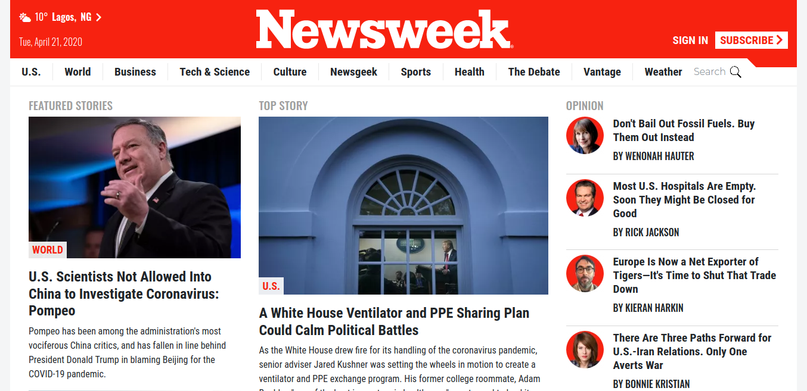

# newsweek.com clone

> I built a replica of the newsweek website using twitter bootstrap.

## Built With

- HTML5
- CSS3
- Bootstrap
- Font awesome
- Google fonts

## Live Demo

[check it out :point_right:](https://newsweek-clone-by-paul.netlify.app/)

## Authors

👤 **Author**

- Email: [ajuzepaul@gmail.com](ajuzepaul@gmail.com)
- Github: [@misterpaul4](https://github.com/misterpaul4)
- Twitter: [@paulajuze](https://twitter.com/paulajuze)
- Linkedin: [Chukwuebuka Paul Ajuizeogu](https://www.linkedin.com/in/chukwuebuka-paul-ajuizeogu/)

## 🤝 Contributing

Contributions, issues and feature requests are welcome!

Feel free to check the [issues page](issues/).

## Show your support

Give a ⭐️ if you like this project!
